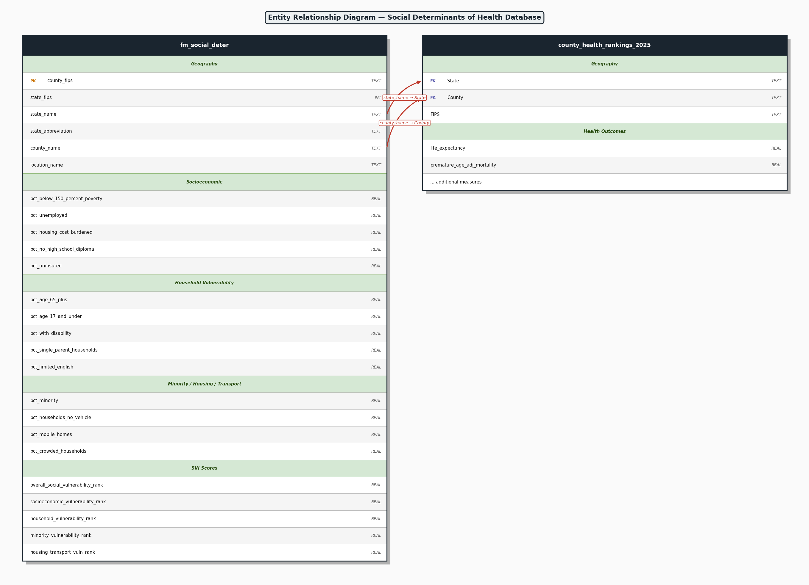
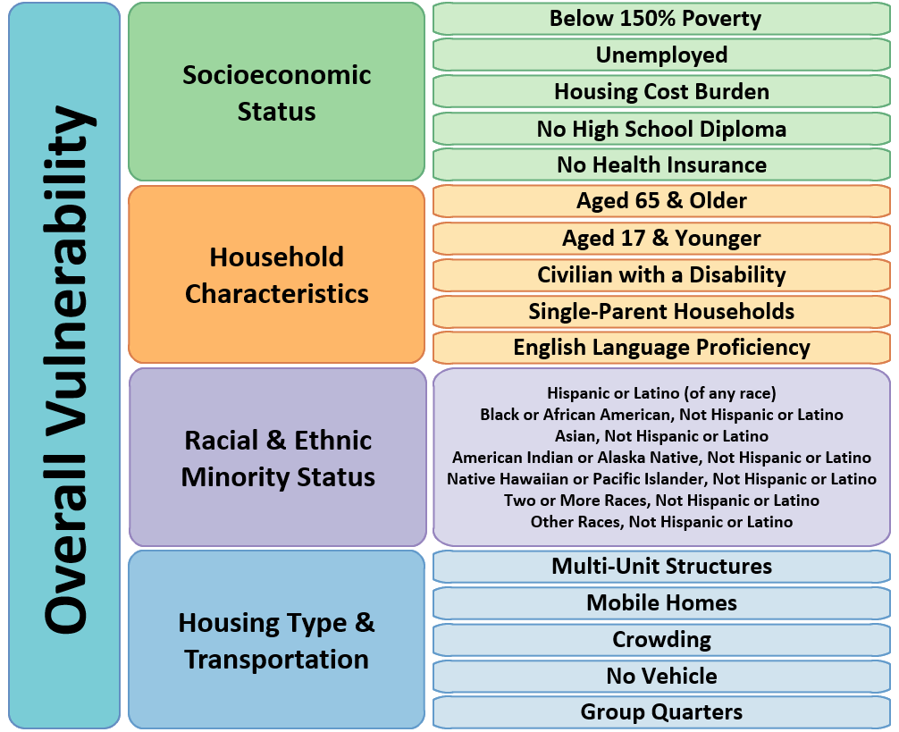

# Patterns of Vulnerability
## Social and Health Indicators in Kentucky and Indiana

**Objective**
This project analyzes county-level social determinants of health in Kentucky and Indiana, now with national-average baselines, and connects those patterns to health context from County Health Rankings. The goal is to identify meaningful county-level risk patterns that can support interpretation, communication, and planning.

**Database Design Justification**
The database is designed for analytics at the county level, which is the shared unit across both source datasets. This was done to keep joins consistent, reduce setup complexity, and make results easy to reproduce in a notebook workflow. A simple SQLite schema was used to support reliable grouped SQL summaries and Kentucky/Indiana plus national comparisons.

**Project Overview**
Using the project files in this repository, the workflow:

1. Loads and standardizes social determinant and health rankings data.
2. Stores analysis-ready tables in a SQLite database.
3. Runs SQL checks, filtered comparisons, and grouped summaries.
4. Produces visuals such as comparisons, correlations, and vulnerability rankings.
5. Summarizes findings in the notebook narrative.

**Author**
- Francine Massaro
- GitHub: fmassaro1966/CYSocialDeterminatesFM

**Repository Files**
- Data/FMsocial-deter.csv: Social determinant source data.
- Data/2025 County Health Rankings Data.csv: County health rankings source data.
- Data/socialdeterminates.db: SQLite database used in the notebook.
- Data/erd_diagram.png: ERD image generated from the notebook workflow.
- Notebook/Socialdeterminants2.ipynb: Main analysis notebook.
- requirements.txt: Project dependencies.
- image.png: Current project image.

**Project Setup Instructions**
1. Clone the repository.
2. Open the repository folder in VS Code.
3. Create and activate a virtual environment.
4. Install dependencies from the requirements file: `requirements.txt`.
5. Run: `pip install -r requirements.txt` from the project root folder.
6. Open Notebook/Socialdeterminants2.ipynb and run all cells.

**Virtual Environment Commands**
| Command | Linux/Mac | Windows/GitBash |
|---|---|---|
| Create | python3 -m venv .venv | python -m venv .venv |
| Activate | source .venv/bin/activate | source .venv/Scripts/activate |
| Install | pip install -r requirements.txt | pip install -r requirements.txt |
| Launch Notebook | jupyter notebook Notebook/Socialdeterminants2.ipynb | jupyter notebook Notebook/Socialdeterminants2.ipynb |
| Deactivate | deactivate | deactivate |

**Notebook Workflow**
1. Problem framing and analysis goals.
2. Imports, display settings, and data load.
3. Schema review and column standardization.
4. Cleaning and data quality checks.
5. Exploratory plots for selected indicators.
6. SQLite setup and table validation.
7. SQL preview and state-focused query checks.
8. Loop plus GROUP BY summaries.
9. Life expectancy context section.
10. Correlation and vulnerability visuals.
11. Final findings summary.

**Database Entity Relationship Diagram**

**Social Determinants Determined by CDC**

**Analysis Outputs**
- Kentucky versus Indiana versus National Average comparisons for key indicators.
- Kentucky versus Indiana versus National Average single-parent household comparison.
- Database table checks and schema-aware SQL queries.
- Null and duplicate diagnostics.
- Loop-driven grouped summaries.
- Correlation heatmap and vulnerability ranking chart.

**Latest Graph Snapshot**
- Key indicator comparison (KY | IN | National):
	- Poverty (<150% FPL): 30.13 | 20.37 | 23.95
	- Unemployed: 5.82 | 4.17 | 4.95
	- No HS Diploma: 15.46 | 10.70 | 11.65
	- Uninsured: 6.20 | 7.95 | 9.51
- Single-parent household comparison (%): Kentucky 5.92 | Indiana 5.48 | National Average 5.73

**Technologies Used**
- Python
- pandas
- numpy
- matplotlib
- seaborn
- SQLite
- Jupyter Notebook
- VS Code
- Git and GitHub
- Markdown
- AI and ChatGPT for polishing of wording and code validation

**Data Source Files**
- Data/FMsocial-deter.csv
- Data/2025 County Health Rankings Data.csv

**Contribution**
Contributions are welcome through issues and pull requests.
